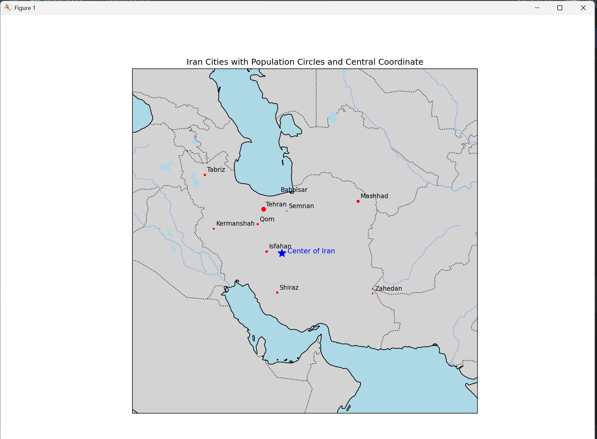

# Iran Cities Map Visualization
This project visualizes a map of Iranian cities using Python and the libraries Cartopy, Matplotlib, and Pandas. Each city is plotted based on its geographic coordinates, and the circle size reflects the city's population. The approximate geographical center of Iran is also marked on the map.


## Required Files
iran_cities.csv: A CSV file containing city names, latitude, longitude, and population.

## Used Libraries
- pandas

- matplotlib

- cartopy

- numpy

## Features
- Displays a map of Iran with coastlines, borders, lakes, and rivers.

- Plots cities with circle sizes proportional to their populations.

- Marks the approximate geographic center of Iran with a blue star.

- Converts the center’s coordinates to Degrees/Minutes/Seconds (DMS) format.

## Sample Output (optional)
You can add a screenshot of the output here:


## How to Run
Make sure you have the required libraries installed:

``` pip install pandas matplotlib cartopy numpy ```
Then run the script:

``` python iran_map.py ```
